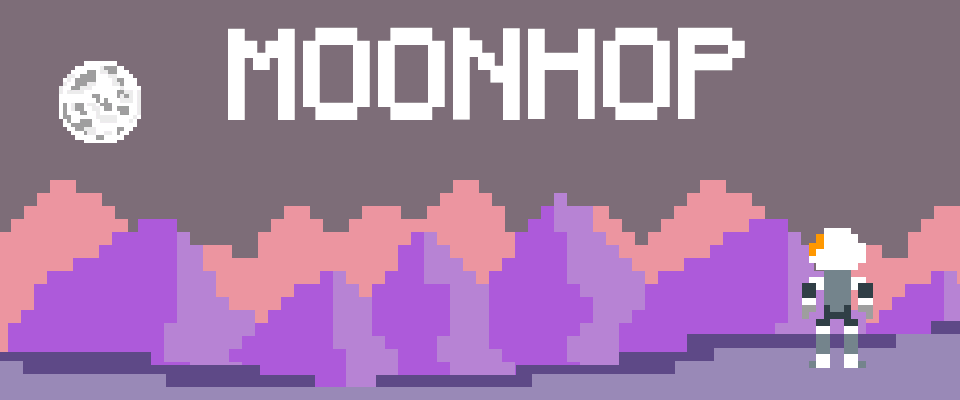

  

The **Moon recycle station** is broken, and as a result, space debris is everywhere, destroying the Moon facilities and falling quickly to the Earth.

**Hop to the Moon**, travel along the different Earth's atmospheric layers dodging every obstacle along the way, boost your rockets and recover damage picking up power-ups.

You are the only one who can save us!

 

  

## Controls

- Use **arrow keys** or **WASD keys** to move our character.

## Score

It is divided in three sections:

- **Time**: Try to reach the moon in the shortest amount of time.
- **Points**: Get boost or damage items to get points.
- **Hits**: The less hits the better.

## Background and Technology used

I made **MoonHop** to participate in the **2020 Game Off** game jam.

I have used **Unity** as game engine and [Pixel Art CSS](https://www.pixelartcss.com/) web app to create the sprites.

## Credits

I wanted to give credit to all of the great assets that I have used in the game such as music, sounds, 3d models and font. 
I can't thank you enough for all your good quality free assets you all share.

### 3D Models and animations

- [Kenney assets](https://www.kenney.nl/assets)

### Music

- Story: [Alien Synth Loops](https://freesound.org/people/Zetauri/sounds/277251/)
- Main title: [Let Me See Ya Bounce](https://freesound.org/people/DominikBraun/sounds/483502/)
- Levels: [Space Jazz](http://dig.ccmixter.org/files/NiGiD/46628) x2 speed
- Boss fight: [l'antre du diable](https://freesound.org/people/rap2h/sounds/223241/)
- Ending: [Chiptune melody](https://freesound.org/people/emceeciscokid/sounds/403372/)

### Sound effects and voice
- Game over: [Death](https://freesound.org/people/jacksonacademyashmore/sounds/414209/)
- Interference: [Extreme Interference](https://freesound.org/people/CS279/sounds/202411/)
- Hop: [ 04999 analog game hitting laser bonus](https://freesound.org/people/Robinhood76/sounds/231276/)
- Damage: [8-bit - Damage](https://freesound.org/people/Antikore/sounds/457195/)
- Power-up: [bleeps and beeps 2](https://freesound.org/people/steveygos93/sounds/103582/)
- Radio: [3beeps](https://freesound.org/people/pera/sounds/56229/)
- Atmosphere layer change: [lil boost](https://freesound.org/people/symphoid/sounds/157419/)
- Boost: [rez_fx](https://freesound.org/people/laya/sounds/33326/)
- Rockets: [Seamless Rocket Booster Roar & Crackle](https://freesound.org/people/NickTimesAudio/sounds/494827/)
- Approching to Moon: [Jet_Bypassing](https://freesound.org/people/MATRIXXX_/sounds/444855/)
- Boss shoot: [Laser shoot](https://freesound.org/people/MusicLegends/sounds/344310/)
- Landing on the Moon: [Landing_02](https://freesound.org/people/Artmasterrich/sounds/345418/)
- Robotic voice: [Robot voice generator](https://lingojam.com/RobotVoiceGenerator)

### Font

- [Minecraftia](https://www.dafont.com/minecraftia.font)

## Screenshots

 

  

 

  

